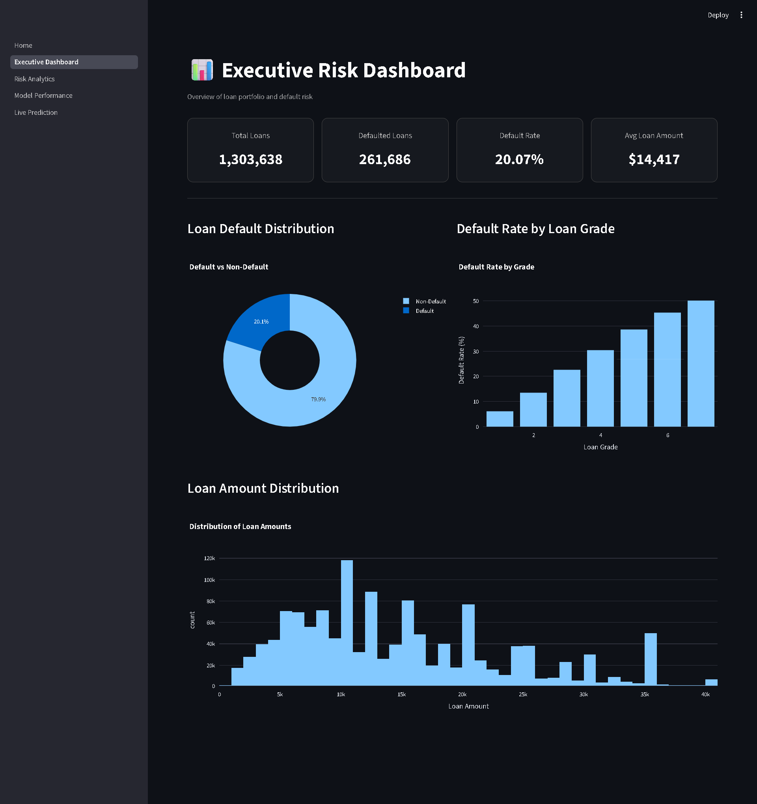
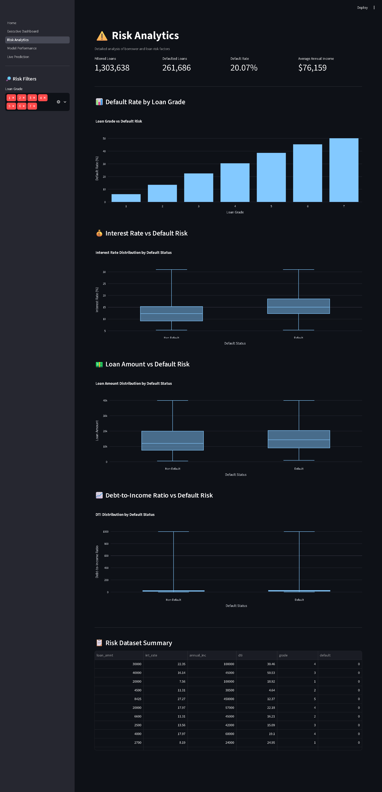
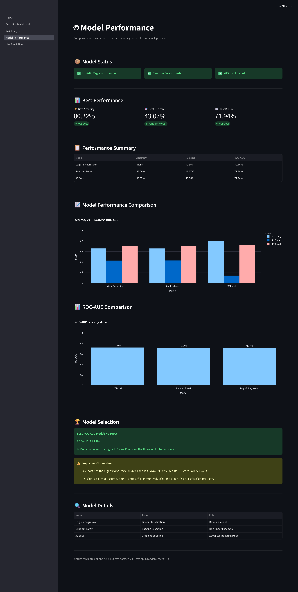
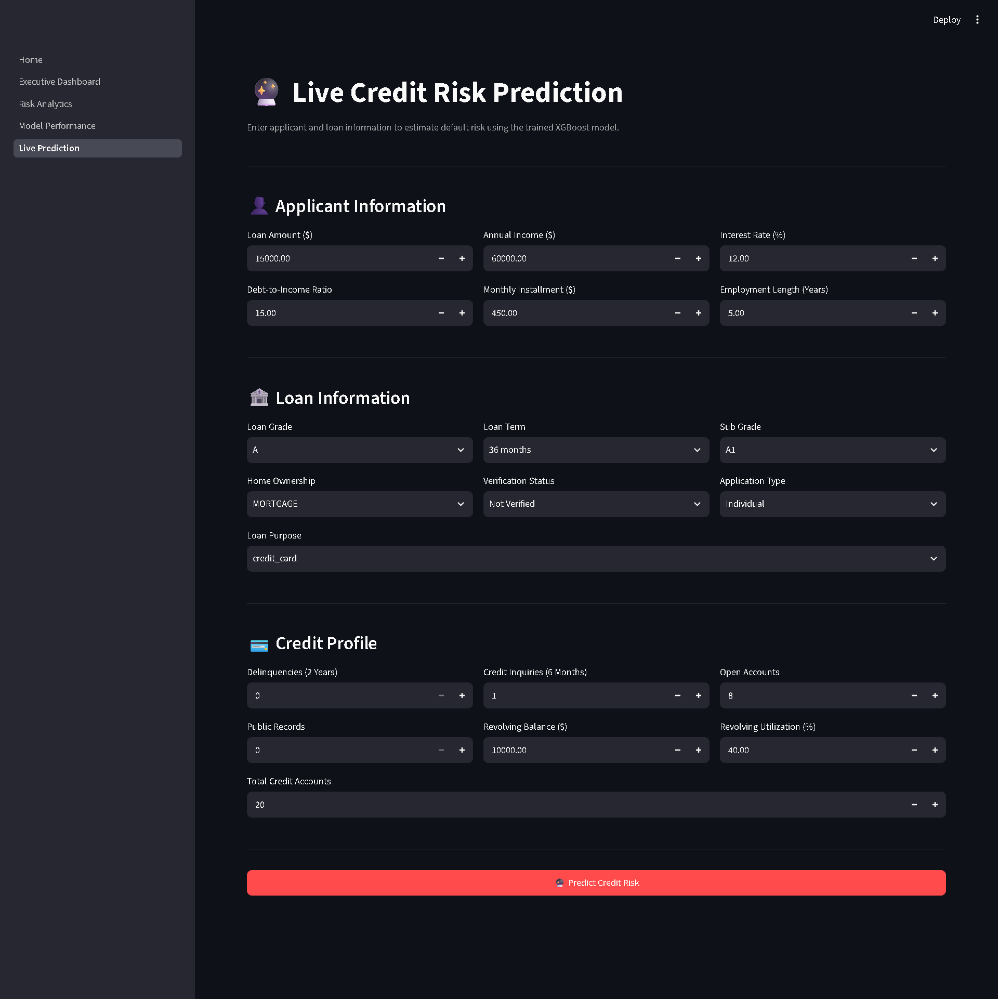
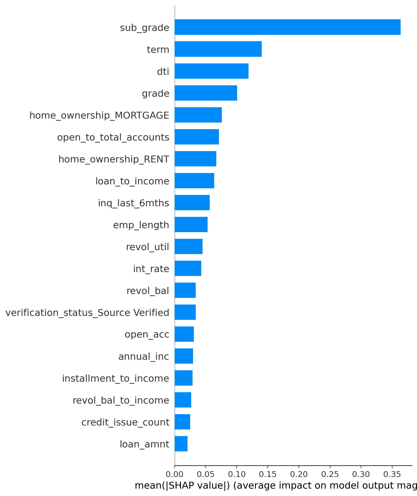
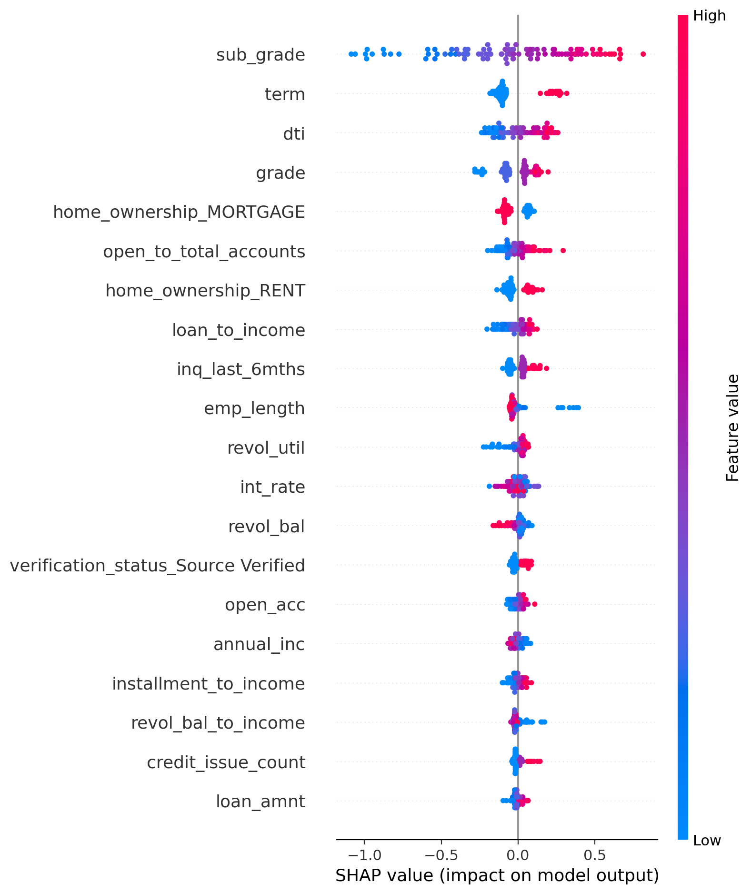
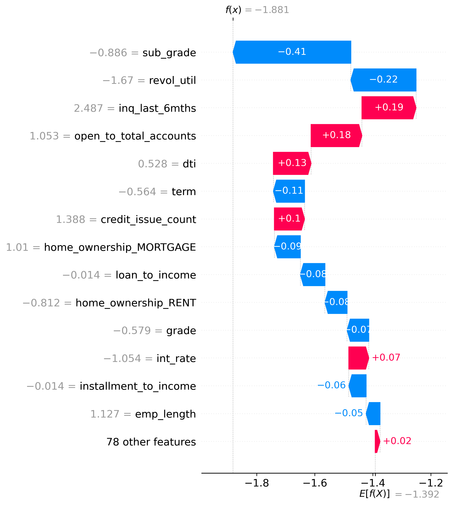

````markdown
# 🏦 Credit Risk Intelligence Platform

🐍 Python &nbsp; ◈ &nbsp; 🤖 Machine Learning &nbsp; ◈ &nbsp; ⚖️ SMOTE &nbsp; ◈ &nbsp; 🔍 SHAP &nbsp; ◈ &nbsp; 🚀 Streamlit &nbsp; ◈ &nbsp; 🗄️ SQL

**An end-to-end machine learning and analytics platform for analyzing loan default risk, explaining model predictions, and supporting data-driven credit-risk decisions.**

[](https://aditya280505-credit-risk-intelligence-platform-apphome-gqpygr.streamlit.app/)
[](https://github.com/aditya280505/Credit-Risk-Intelligence-Platform)
[](https://www.python.org/)
[](https://streamlit.io/)
[](https://shap.readthedocs.io/)

---

# 🌐 Live Demo

### 🚀 Explore the Interactive Credit Risk Dashboard

**https://aditya280505-credit-risk-intelligence-platform-apphome-gqpygr.streamlit.app/**

The application provides:

- Executive credit-risk analytics
- Portfolio-level KPIs
- Risk analytics
- Machine learning model comparison
- SHAP explainability
- Individual loan-risk prediction

---

# 📖 Overview

This project is an **end-to-end Credit Risk Intelligence Platform** built using **Python, SQL, Machine Learning, SMOTE, SHAP, and Streamlit**.

The platform analyzes historical loan data to identify patterns associated with loan defaults, evaluate multiple machine learning models, explain model predictions, and provide interactive risk analytics through a web-based dashboard.

The project combines:

- Data Cleaning & Preprocessing
- Exploratory Data Analysis (EDA)
- Feature Engineering
- SQL Business Analytics
- Imbalanced Learning
- Machine Learning Classification
- Model Evaluation
- Explainable AI using SHAP
- Interactive Streamlit Dashboard
- Individual Loan-Risk Prediction

into one complete credit-risk analytics solution.

> **Disclaimer:** This project is developed for educational and portfolio purposes. Model predictions should not be used as the sole basis for real-world lending or financial decisions.

---

# 🎯 Problem Statement

Financial institutions process large numbers of loan applications and need reliable and scalable methods to identify applicants who may have a higher probability of default.

Traditional manual assessment can be:

- Time-consuming
- Difficult to scale
- Dependent on manual analysis
- Challenging when handling large datasets
- Difficult to standardize across large loan portfolios

The objective of this project is to build a **Credit Risk Intelligence Platform** capable of analyzing borrower and loan characteristics, identifying risky patterns, predicting default risk, comparing machine learning models, and explaining model predictions.

---

# 💡 Proposed Solution

The platform follows a complete machine learning and analytics workflow:

```text
Raw LendingClub Data
       │
       ▼
Data Cleaning & Preprocessing
       │
       ▼
Exploratory Data Analysis
       │
       ▼
Feature Engineering
       │
       ▼
Train / Test Split
       │
       ▼
SMOTE Class Balancing
       │
       ▼
Machine Learning Models
       │
       ├── Logistic Regression
       ├── Random Forest
       └── XGBoost
       │
       ▼
Model Evaluation
       │
       ▼
SHAP Explainability
       │
       ▼
Streamlit Risk Dashboard
       │
       ▼
Live Loan-Risk Prediction
````

---

# ✨ Key Highlights

* 📊 Portfolio-Level Credit Risk Dashboard
* ⚠️ Loan Default Risk Analytics
* 🤖 Logistic Regression, Random Forest & XGBoost
* ⚖️ SMOTE-Based Imbalanced Learning
* 📈 Model Performance Comparison
* 🔍 SHAP Explainable AI
* 🔮 Individual Loan-Risk Prediction
* 🗄️ SQL-Based Business Analytics
* 🌐 Interactive Streamlit Application
* 💾 Persistent Machine Learning Models

---

# 🚀 Features

## 📊 Executive Risk Dashboard

Provides a portfolio-level overview of credit risk through:

* Total Loans
* Defaulted Loans
* Default Rate
* Average Loan Amount
* Default Distribution
* Grade-wise Default Analysis
* Loan Amount Distribution
* Portfolio Risk Indicators

## ⚠️ Risk Analytics

Provides detailed analysis of borrower and loan characteristics associated with credit risk.

Key areas include:

* Loan amount
* Interest rate
* Annual income
* Debt-to-income ratio
* Credit inquiries
* Delinquencies
* Revolving utilization
* Credit accounts
* Loan grades
* Borrower financial characteristics

## 🤖 Model Performance

Compares three classification algorithms:

* Logistic Regression
* Random Forest
* XGBoost

Evaluation metrics include:

* Accuracy
* Precision
* Recall
* F1 Score
* ROC-AUC

## 🔍 Explainable AI

SHAP is used to understand the factors influencing machine learning predictions.

The project includes:

* SHAP Feature Importance
* SHAP Summary Plot
* SHAP Waterfall Plot
* Individual Prediction Explanation

## 🔮 Live Risk Prediction

Users can enter applicant-level loan information through the Streamlit application and receive a model-based risk prediction.

The prediction pipeline:

```text
Applicant Information
       │
       ▼
Input Validation
       │
       ▼
Feature Processing
       │
       ▼
Feature Scaling
       │
       ▼
Trained ML Model
       │
       ▼
Risk Prediction
```

---

# 🛠 Tech Stack

## Programming

* Python
* SQL

## Libraries

* Pandas
* NumPy
* Scikit-Learn
* XGBoost
* imbalanced-learn
* SHAP
* Plotly
* Matplotlib
* Joblib

## Machine Learning

* Logistic Regression
* Random Forest Classifier
* XGBoost Classifier
* SMOTE

## Explainable AI

* SHAP
* Feature Importance
* Summary Plot
* Waterfall Plot

## Dashboard

* Streamlit

## Database / Analytics

* SQL

## Development

* Jupyter Notebook
* VS Code

## Version Control

* Git
* GitHub

---

# 📂 Project Structure

```text
Credit-Risk-Intelligence-Platform
│
├── app
│   ├── Home.py
│   └── pages
│       ├── 1_Executive_Dashboard.py
│       ├── 2_Risk_Analytics.py
│       ├── 3_Model_Performance.py
│       └── 4_Live_Prediction.py
│
├── data
│   ├── raw
│   ├── processed
│   └── external
│
├── models
│   ├── logistic.pkl
│   ├── random_forest.pkl
│   ├── xgboost.pkl
│   └── scaler.pkl
│
├── notebook
│   ├── 01_data_cleaning.ipynb
│   ├── 02_eda.ipynb
│   ├── 03_sql_analysis.ipynb
│   ├── 04_feature_engineering.ipynb
│   ├── 05_model_training.ipynb
│   ├── 06_model_evaluation.ipynb
│   └── 07_shap_explainability.ipynb
│
├── screenshots
│   ├── executive_dashboard.png
│   ├── risk_analytics.png
│   ├── model_performance.png
│   ├── live_prediction.png
│   ├── shap_feature_importance.png
│   ├── shap_summary.png
│   └── shap_waterfall.png
│
├── sql
│
├── src
│   ├── preprocessing.py
│   ├── feature_engineering.py
│   ├── imbalance_handling.py
│   ├── train_model.py
│   ├── evaluate_model.py
│   ├── predict.py
│   └── shap
│
├── requirements.txt
├── .gitignore
└── README.md
```

---

# 📚 Dataset

The project uses a **LendingClub historical loan dataset** containing loan, borrower, financial, employment, and credit-related information.

The processed modeling dataset contains approximately:

* **1,303,638 records**
* **93 modeling features**

### 🎯 Target Variable

```text
default
```

Where:

```text
0 → Non-Default
1 → Default
```

---

# 📋 Important Dataset Features

The modeling dataset contains financial, loan, employment, and credit-related variables.

| Feature               | Description                         |
| --------------------- | ----------------------------------- |
| `loan_amnt`           | Loan amount                         |
| `term`                | Loan repayment term                 |
| `int_rate`            | Interest rate                       |
| `installment`         | Monthly installment                 |
| `grade`               | Loan grade                          |
| `sub_grade`           | Loan sub-grade                      |
| `emp_length`          | Employment length                   |
| `home_ownership`      | Home ownership status               |
| `annual_inc`          | Annual income                       |
| `verification_status` | Income verification status          |
| `purpose`             | Loan purpose                        |
| `addr_state`          | Borrower state                      |
| `dti`                 | Debt-to-income ratio                |
| `delinq_2yrs`         | Delinquencies in previous two years |
| `inq_last_6mths`      | Credit inquiries                    |
| `open_acc`            | Number of open accounts             |
| `pub_rec`             | Public record count                 |
| `revol_bal`           | Revolving credit balance            |
| `revol_util`          | Revolving credit utilization        |
| `total_acc`           | Total credit accounts               |
| `application_type`    | Loan application type               |

---

# ⚙️ Data Preprocessing

The LendingClub dataset contains a large number of records and variables.

The preprocessing workflow includes:

* Selecting relevant variables
* Removing unnecessary columns
* Handling missing values
* Converting data types
* Encoding categorical variables
* Preparing numerical variables
* Creating the final modeling dataset
* Separating target and predictor variables

The processed dataset is then used for exploratory analysis, feature engineering, and machine learning.

---

# 🔧 Feature Engineering

Additional financial-risk features were created to provide the models with more meaningful information about borrower financial behavior.

## Loan-to-Income Ratio

```text
loan_to_income = loan_amnt / annual_inc
```

Measures the size of the loan relative to the borrower's annual income.

## Installment-to-Income Ratio

```text
installment_to_income = installment / annual_inc
```

Represents the monthly loan payment burden relative to income.

## Open-to-Total Accounts Ratio

```text
open_to_total_accounts = open_acc / total_acc
```

Provides information about the proportion of currently open credit accounts.

## Credit Issue Count

A combined indicator based on credit-related negative signals such as:

* Delinquencies
* Public records
* Recent credit inquiries

## Revolving Balance-to-Income Ratio

```text
revol_bal_to_income = revol_bal / annual_inc
```

Provides an additional indicator of revolving credit burden relative to income.

---

# ⚖️ Class Imbalance Handling

Loan-default prediction is an **imbalanced classification problem** because non-default observations significantly outnumber default observations.

The project uses **SMOTE (Synthetic Minority Over-sampling Technique)** to improve minority-class representation during model training.

### SMOTE Workflow

```text
Original Dataset
       │
       ▼
Train / Test Split
       │
       ├──────────────► Test Dataset
       │                 Untouched
       │
       ▼
Training Dataset
       │
       ▼
SMOTE
       │
       ▼
Balanced Training Dataset
       │
       ▼
Machine Learning Models
```

SMOTE is applied only to the training data.

The test dataset remains untouched to provide a more reliable evaluation of model performance.

---

# 🤖 Machine Learning Models

Three classification algorithms were trained and evaluated.

## 1. Logistic Regression

Logistic Regression was used as an interpretable baseline model.

**Advantages:**

* Simple
* Fast
* Interpretable
* Useful as a benchmark

## 2. Random Forest

Random Forest is an ensemble learning algorithm based on multiple decision trees.

It can capture:

* Non-linear relationships
* Feature interactions
* Complex patterns in structured data

## 3. XGBoost

XGBoost is a gradient-boosting algorithm designed for high-performance classification on structured/tabular datasets.

It is useful for:

* Complex relationships
* Non-linear patterns
* Feature interactions
* Large tabular datasets

---

# 📈 Model Performance

The models were evaluated on the held-out test dataset.

| Model               |   Accuracy |   F1 Score |    ROC-AUC |
| ------------------- | ---------: | ---------: | ---------: |
| Logistic Regression | **66.10%** | **42.90%** | **70.84%** |
| Random Forest       | **66.06%** | **43.07%** | **71.24%** |
| XGBoost             | **80.32%** | **13.58%** | **71.94%** |

---

# 🔎 Model Performance Interpretation

The results demonstrate why multiple evaluation metrics are important for credit-risk classification.

## XGBoost

XGBoost achieved:

* **Highest Accuracy:** 80.32%
* **Highest ROC-AUC:** 71.94%

However, its **F1 Score of 13.58%** indicates weak performance on the minority/default class under the evaluated classification threshold.

## Random Forest

Random Forest achieved:

* **Accuracy:** 66.06%
* **F1 Score:** 43.07%
* **ROC-AUC:** 71.24%

Among the evaluated models, Random Forest provides a stronger balance between minority-class performance and overall discrimination.

## Logistic Regression

Logistic Regression achieved:

* **Accuracy:** 66.10%
* **F1 Score:** 42.90%
* **ROC-AUC:** 70.84%

It provides a useful interpretable baseline for comparison.

## Important Observation

Accuracy alone should not be used to select a credit-risk model, particularly when the target classes are imbalanced.

A model can achieve high accuracy while still missing a significant number of actual defaults.

Therefore, credit-risk evaluation should also consider:

* Precision
* Recall
* F1 Score
* ROC-AUC
* Precision-Recall AUC
* Classification threshold analysis

---

# 🔍 Explainable AI with SHAP

**SHAP (SHapley Additive exPlanations)** is used to interpret machine learning predictions.

SHAP helps answer:

* Which features influence predictions?
* Which variables contribute to higher predicted risk?
* Which variables contribute to lower predicted risk?
* Which features are globally most important?
* Why did the model make a specific prediction?

This improves model transparency and makes the machine learning workflow easier to understand.

---

# 📊 SHAP Visualizations

## SHAP Feature Importance

Shows the features that have the greatest overall influence on model predictions.

## SHAP Summary Plot

Provides a global view of feature importance and the direction and magnitude of feature impact.

## SHAP Waterfall Plot

Explains how individual features contribute to a specific prediction by showing how each feature pushes the prediction higher or lower.

---

# 🖥️ Streamlit Dashboard

The project is deployed as a multi-page Streamlit application.

```text
Home
 │
 ├── 📊 Executive Dashboard
 │
 ├── ⚠️ Risk Analytics
 │
 ├── 🤖 Model Performance
 │
 └── 🔮 Live Prediction
```

---

# 📊 Executive Risk Dashboard

The Executive Dashboard provides a high-level overview of the loan portfolio.

It includes:

* Total loan applications
* Defaulted loans
* Default rate
* Average loan amount
* Default distribution
* Grade-wise default analysis
* Portfolio-level visualizations

### Dashboard Screenshot



---

# ⚠️ Risk Analytics Dashboard

The Risk Analytics dashboard provides deeper analysis of borrower and loan characteristics.

It can be used to explore relationships between:

* Loan amount
* Interest rate
* Income
* DTI
* Revolving utilization
* Delinquencies
* Credit inquiries
* Loan grades
* Credit account characteristics

### Dashboard Screenshot



---

# 🤖 Model Performance Dashboard

The Model Performance page provides a side-by-side comparison of the trained classification models.

It presents:

* Accuracy
* F1 Score
* ROC-AUC
* Model comparison
* Performance visualizations

### Dashboard Screenshot



---

# 🔮 Live Risk Prediction

The Live Prediction page allows users to enter applicant-level loan information and generate a model-based risk prediction.

### Prediction Workflow

```text
Applicant Information
       ↓
Input Validation
       ↓
Feature Processing
       ↓
Feature Scaling
       ↓
Trained ML Model
       ↓
Risk Prediction
```

### Dashboard Screenshot



---

# 🔍 SHAP Feature Importance

The SHAP feature-importance visualization highlights the variables that have the greatest influence on model predictions.



---

# 📈 SHAP Summary Plot

The SHAP summary visualization provides a global explanation of model behavior across observations.



---

# 🧩 SHAP Waterfall Plot

The SHAP waterfall visualization explains how individual features contribute to a specific model prediction.



---

# 🔄 End-to-End Workflow

```text
Raw LendingClub Data
       │
       ▼
Data Cleaning & Preprocessing
       │
       ▼
Exploratory Data Analysis
       │
       ▼
SQL Business Analysis
       │
       ▼
Feature Engineering
       │
       ▼
Train / Test Split
       │
       ▼
SMOTE on Training Data
       │
       ├──────────────┬──────────────┐
       ▼              ▼              ▼
Logistic Regression  Random Forest  XGBoost
       │              │              │
       └──────────────┼──────────────┘
                      ▼
              Model Evaluation
                      │
                      ▼
             SHAP Explainability
                      │
                      ▼
             Streamlit Dashboard
                      │
                      ▼
             Live Risk Prediction
```

---

# 🗄️ SQL Business Analysis

SQL is used to perform business-oriented analysis on the loan portfolio.

Example analytical questions include:

* Which loan grades have the highest default rates?
* What is the average loan amount by grade?
* How many defaults occur in each loan category?
* Which states have higher default rates?
* How does borrower income vary across risk segments?

### Example SQL Analysis

```sql
SELECT
    grade,
    COUNT(*) AS total_loans,
    SUM(default) AS defaulted_loans,
    ROUND(AVG(default) * 100, 2) AS default_rate
FROM loans
GROUP BY grade
ORDER BY default_rate DESC;
```

This connects machine learning outputs with practical business questions and portfolio analysis.

---

# 💼 Business Problems Solved

### Risk Identification

Identify loan and borrower characteristics associated with higher default risk.

### Portfolio Monitoring

Monitor default rates and risk patterns across loan segments.

### Borrower Assessment

Analyze financial and credit characteristics of applicants.

### Decision Support

Provide data-driven insights that can support credit-risk assessment.

### Explainability

Help analysts understand the factors contributing to model predictions.

### Scalability

Automate parts of the risk-analysis process for large loan portfolios.

---

# 📊 Business Questions the Platform Can Answer

The platform can help investigate questions such as:

* Which loan grades have higher default rates?
* How does loan amount relate to default risk?
* Does higher DTI correspond to higher risk?
* Which borrower characteristics influence predictions?
* Which features are most important to the machine learning model?
* Which classification model performs best under different evaluation metrics?
* How can an individual prediction be explained?
* What patterns are visible across different risk segments?

---

# 💾 Model Persistence

Trained machine learning models and preprocessing objects are persisted using **Joblib**.

```text
models/
│
├── logistic.pkl
├── random_forest.pkl
├── xgboost.pkl
└── scaler.pkl
```

This allows the Streamlit application to load trained models without retraining them every time the application starts.

---

# 🚀 How to Run Locally

## 1. Clone the Repository

```bash
git clone https://github.com/aditya280505/Credit-Risk-Intelligence-Platform.git
cd Credit-Risk-Intelligence-Platform
```

## 2. Create a Virtual Environment

```bash
python -m venv .venv
```

## 3. Activate the Environment

### Windows PowerShell

```bash
.venv\Scripts\Activate.ps1
```

### Windows Command Prompt

```bash
.venv\Scripts\activate
```

### macOS / Linux

```bash
source .venv/bin/activate
```

## 4. Install Dependencies

```bash
pip install -r requirements.txt
```

## 5. Run the Streamlit Application

```bash
streamlit run app/Home.py
```

The application will open in your default web browser.

---

# 🌐 Online Application

### 🚀 Live Demo

[Open Credit Risk Intelligence Platform](https://aditya280505-credit-risk-intelligence-platform-apphome-gqpygr.streamlit.app/)

### 💻 GitHub Repository

[View Source Code](https://github.com/aditya280505/Credit-Risk-Intelligence-Platform)

---

# ⚠️ Current Limitations

The current implementation has several limitations:

* The models are trained on a historical static dataset.
* XGBoost achieves high accuracy but has a substantially lower F1 score under the evaluated threshold.
* Classification thresholds have not yet been optimized specifically for business risk tolerance.
* Probability calibration has not yet been implemented.
* Real-time data ingestion is not currently available.
* Model monitoring and automated drift detection are not implemented.
* The system is intended for educational and portfolio demonstration rather than production lending decisions.

These limitations provide clear opportunities for future development.

---

# 🔮 Future Improvements

* Minority-Class Recall Optimization
* Precision-Recall Optimization
* Classification Threshold Tuning
* Probability Calibration
* Hyperparameter Optimization
* Cross-Validation
* Precision-Recall AUC Analysis
* Cost-Sensitive Learning
* Model Monitoring
* Data Drift Detection
* Automated Model Retraining
* Real-Time Prediction API
* Cloud Database Integration
* Real-Time Loan Data Integration
* Advanced Risk Segmentation
* Model Governance
* Audit Logging
* Production-Grade Deployment

---

# 🎓 Learning Outcomes

This project demonstrates practical experience with:

* Python for Data Analytics
* Pandas and NumPy
* Data Preprocessing
* Exploratory Data Analysis
* Feature Engineering
* SQL Business Analytics
* Logistic Regression
* Random Forest
* XGBoost
* Imbalanced Learning
* SMOTE
* Model Evaluation
* Accuracy
* Precision
* Recall
* F1 Score
* ROC-AUC
* Explainable AI
* SHAP
* Streamlit
* Joblib
* Git and GitHub
* Machine Learning Deployment
* End-to-End ML Project Development

---

# 🧠 Skills Demonstrated

```text
Data Analytics
│
├── Python
├── Pandas
├── NumPy
├── Data Cleaning
└── Exploratory Data Analysis
        │
        ▼
Machine Learning
│
├── Logistic Regression
├── Random Forest
├── XGBoost
├── SMOTE
└── Model Evaluation
        │
        ▼
Explainable AI
│
└── SHAP
        │
        ▼
Business Analytics
│
└── SQL
        │
        ▼
Visualization & Deployment
│
├── Plotly
├── Matplotlib
└── Streamlit
        │
        ▼
Version Control
│
└── Git + GitHub
```

---

# 👨‍💻 Author

**Aditya Pravin Borgaonkar**

B.Tech Computer Science Engineering (Artificial Intelligence & Analytics)
MIT Art, Design & Technology University

### Areas of Interest

* Artificial Intelligence
* Data Analytics
* Machine Learning
* Credit Risk Analytics
* Business Intelligence
* Explainable AI

### 📧 Email

[borgaonkaraditya1@gmail.com](mailto:borgaonkaraditya1@gmail.com)

### 🔗 GitHub

[https://github.com/aditya280505](https://github.com/aditya280505)

### 🔗 LinkedIn

[https://linkedin.com/in/adityaborgaonkar280505/](https://linkedin.com/in/adityaborgaonkar280505/)

---

# ⭐ Project Goal

The goal of this project is to demonstrate an **end-to-end Credit Risk Intelligence Platform** combining:

**Data Analytics + SQL + Machine Learning + Imbalanced Learning + Explainable AI + Interactive Dashboards**

The project demonstrates how historical loan data can be transformed into meaningful credit-risk insights, machine learning predictions, and explainable decision-support information through a complete analytics pipeline.

---

# ⭐ Support

If you found this project useful, consider giving it a **⭐ Star** on GitHub.

It helps others discover the project and supports continued development.

---

**Built with Python, Machine Learning, SQL, SHAP, and Streamlit.**

```
```
